### Hi there! I'm Margarita — a fullstack developer who turns ideas into production-ready products 💗

## 💖 About me

I'm a **Middle Fullstack Developer** based near Moscow. I build reliable web products end to end — from product discovery and UI design to backend architecture, integrations, deployment, and support.

- Built **30+ fullstack applications from scratch** for entertainment, education, e-commerce, fintech, media, and internal operations
- Design APIs and application architecture, develop interfaces, model databases, and integrate external services
- Work with real-time systems, payment flows, 1C integrations, self-service kiosks, restaurant automation, and IoT devices
- Modernize legacy systems through refactoring, performance improvements, testing, and observability
- Create prototypes in Figma and turn them into responsive, accessible interfaces
- Currently improving my English and deepening my knowledge of scalable frontend and backend architecture

> I can take a product from a blank repository to a deployed, maintainable application — and I care just as much about the user experience as I do about the code behind it.

## ✨ What I build

| Area | Experience |
| --- | --- |
| **Ticketing & e-commerce** | Booking platforms, configurable packages, payments, refunds, PDF ticket generation, 1C and kiosk integrations |
| **Interactive products** | Multiplayer quizzes, educational mini-games, children's cybersecurity experiences, animation tools |
| **Business systems** | Digital restaurant menus, Kitchen Display systems, CRM, access control, notifications, meeting-room booking |
| **Media & desktop** | Offline playlist players for park displays, video tools, Electron apps, camera and microscope integrations |
| **Fintech** | Bracelet top-up flows, payment integrations, balance tracking, and automatic end-of-day refunds |

## 💕 Tech stack

### Frontend

  
  
  
  
  
  
  
  

### Backend & data

  
  
  
  
  
  
  

### Engineering

  
  
  
  
  
  
  
  

## 🎓 Education

- **MSc, Applied Mathematics and Computer Science** — Moscow Aviation Institute, 2026
- **MSc, Information Security of Telecommunication Systems** — Plekhanov Russian University of Economics, 2024
- **Fullstack Developer program** — Yandex Practicum

## 💗 GitHub activity

